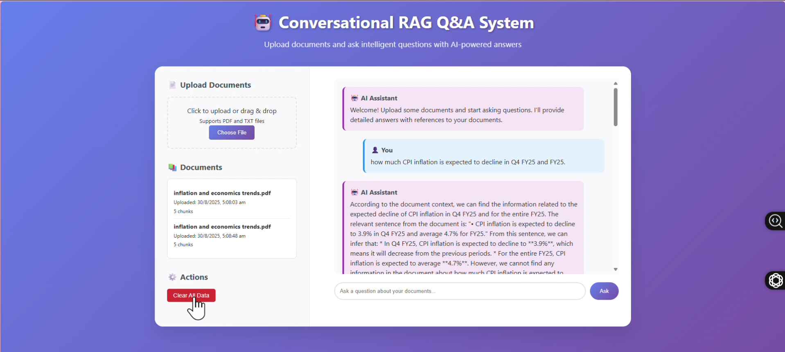
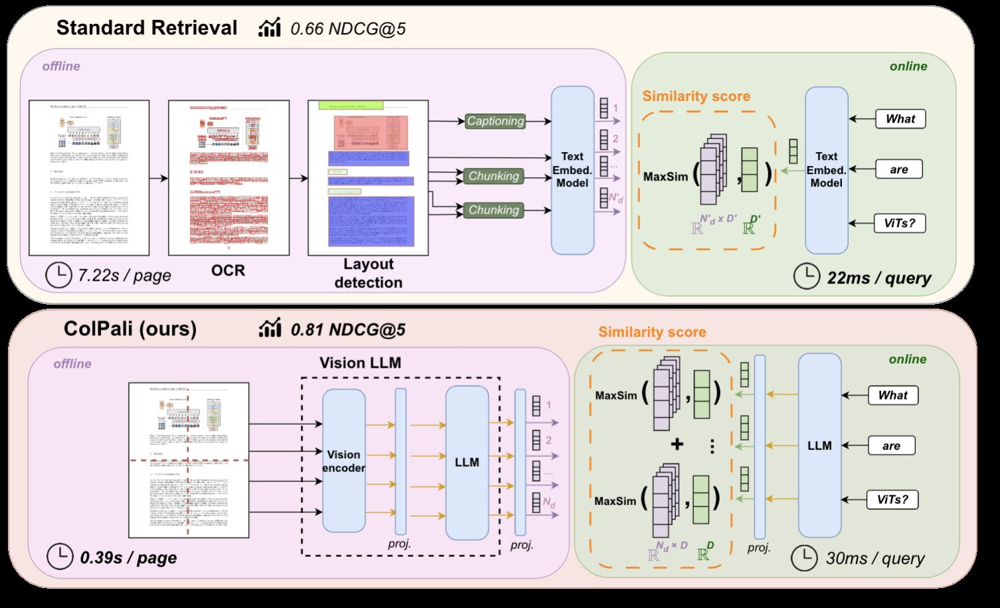
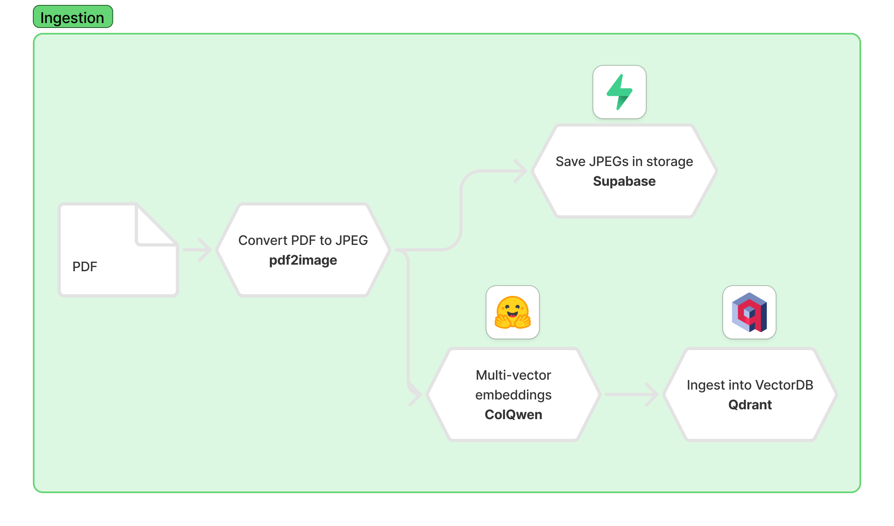
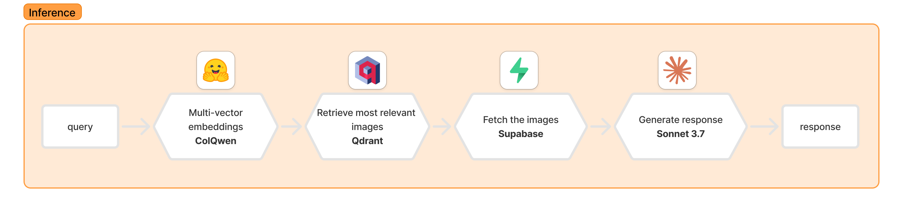

***

# 🤖 Conversational RAG Q&A System

A cutting-edge Retrieval-Augmented Generation (RAG) system for document Q&A with **live demo video**, AI-powered answers, source citations, and transparency – powered by FastAPI, MongoDB Atlas, Qdrant Cloud, and Ollama LLM for optimal performance.

***

## 🚀 Live Demo & Visual Guide

### 🌐 [Live Demo Video](https://drive.google.com/file/d/1AmKZeT00FpON--W6ndOoyf9-xS8-pkL-/view?usp=sharing)

- See the system in action (full workflow, real context)  
- Hosted on RTX 5090 GPU for rapid AI inference




- Main dashboard with document drag-and-drop and chatbot UI
- Real-time upload confirmation and chat response example

### 🔗 [GitHub Repository](https://github.com/LearnCodeWithRam/conversational_RAG_system.git)

***

## ✨ Features

- **Document Upload**: Seamlessly handle PDF & TXT files with automatic text extraction
- **Conversational Q&A**: Multi-turn intelligent chat powered by Ollama LLM
- **Source Citations**: Every answer is reference-backed for trust and transparency
- **Reasoning Traceability**: See precisely how responses are constructed from sources
- **Smart Suggestions**: Follow-up question prompts to deepen dialogue
- **Modern UI**: Drag-and-drop uploads, instant feedback, and live chat
- **Cloud Ready**: Built for MongoDB Atlas & Qdrant; scalable and robust
- **GPU Acceleration**: Harnesses RTX 5090 for fast inference

***

## 🏗️ Architecture

```
┌─────────────┐     ┌──────────────┐     ┌───────────────┐
│  Frontend   │<───►│   FastAPI    │<───►│  Ollama LLM   │
│   (Web UI)  │     │    Server    │     │(llama3.1:8b)  │
└─────────────┘     └────┬─────────┘     └───────────────┘
                         │
                ┌────────▼────────┐
                │ Embeddings      │
                │ (MiniLM, VLM)   │
                └────────┬────────┘
                         │
   ┌────────────┐  ┌─────▼────┐  ┌─────────┐
   │  MongoDB   │  │ Qdrant  │  │  Static │
   │   Atlas    │  │ Vector  │  │   UI    │
   └────────────┘  └─────────┘  └─────────┘
```

***

## 📸 User Interface Gallery

- Main dashboard: drag-and-drop upload area and chat interface
- Upload confirmation and chunking status
- Real-time Q&A with clickable source citations and follow-up prompts

***

## ⚡️ Getting Started

### Prerequisites

- Python 3.11+
- MongoDB Atlas account
- Qdrant Cloud account
- RTX 5090 GPU (for full speed)
- Ollama server with llama3.1:8b model
- Docker (for container deployment)

### 1. Clone & Setup

```bash
git clone https://github.com/LearnCodeWithRam/conversational_RAG_system.git
cd conversational_RAG_system
pip install -r requirements.txt
```

### 2. Environment Configuration

Create a `.env` file (see sample below):

```env

# Qdrant Cloud Configuration

QDRANT_URL=""
QDRANT_API_KEY=""


# MongoDB Cloud Configuration(embeded the DB user id and pass)`
MONGODB_URL= ""
# ollama LLM Configuration
OLLAMA_MODEL = "llama3.1:8b"
OLLAMA_BASE_URL = " "

```

### 3. Database Initialization

```bash
python setup_database.py
```

Tests all connections and sets up collections.

### 4. Download Embedding Model

```bash
python -c "from sentence_transformers import SentenceTransformer; SentenceTransformer('all-MiniLM-L6-v2').save('./all-MiniLM-L6-v2')"
```

### 5. Run Application

```bash
uvicorn main:app --host 0.0.0.0 --port 8000 --reload  # Dev
# OR
uvicorn main:app --host 0.0.0.0 --port 8000           # Production
```

Open `http://localhost:8000` for the UI.

***

## 🐳 Docker Deployment

### Dockerfile

```dockerfile
FROM python:3.10-slim
WORKDIR /app
RUN apt-get update && apt-get install -y \
    gcc \
    poppler-utils \
    && rm -rf /var/lib/apt/lists/*
COPY requirements.txt .
RUN pip install --no-cache-dir -r requirements.txt
COPY . .
EXPOSE 8000
CMD ["uvicorn", "main:app", "--host", "0.0.0.0", "--port", "8000", "--reload"]
```

### Build & Run

```bash
docker build -t rag-system .
docker run -d --env-file .env -p 8000:8000 rag-system
```

#### For GPU:

```bash
docker run --gpus all --env-file .env -p 8000:8000 rag-system
```

***

## 🌍 Nginx Reverse Proxy (Production)

```nginx
server {
    listen 80;
    server_name your-domain.com;

    location / {
        proxy_pass http://127.0.0.1:8000;
        proxy_set_header Host $host;
        proxy_set_header X-Real-IP $remote_addr;
        proxy_set_header X-Forwarded-For $proxy_add_x_forwarded_for;
        proxy_set_header X-Forwarded-Proto $scheme;
        proxy_read_timeout 300;
        proxy_connect_timeout 300;
        proxy_send_timeout 300;
    }
}
```

Restart nginx after configuration change.

***

## 🗂️ Project Structure

```
RAG_SYSTEM/
├── all-MiniLM-L6-v2/
│
├── models/
│   ├── __pycache__/
│   └── pydantic_models.py
│
├── sampl_data/
│   ├── colpali.pdf
│   └── inflation and economics trends.pdf
│
├── services/
│   ├── __pycache__/
│   ├── embeddings.py
│   └── ollama_service.py
│
├── static/
│   └── index.html
│
├── utils/
│   ├── __pycache__/
│   └── util_module.py
│
├── .dockerignore
├── .env
├── .gitignore
├── config.py
├── Dockerfile
├── main.py
├── quick_start.md
├── README.md
├── requirements.txt
└── setup_database.py
```

***

## 📚 API Reference

Sample endpoints:

```bash
# Upload document
curl -X POST "http://your-domain.com/upload" -F "file=@document.pdf"

# Ask a question
curl -X POST "http://your-domain.com/ask" \
  -H "Content-Type: application/json" \
  -d '{ "user_id": "user123", "question": "What is AI?", "top_k": 4 }'

# Get history
curl -X GET "http://your-domain.com/history?user_id=user123"
```

***


## 📊 Current Limitations & Future Enhancements

### Current System Limitations

The existing solution is a **basic text-based RAG system** with the following limitations:

- **Text-Only Processing**: Can only extract and process plain text from PDFs
- **Visual Content Loss**: Cannot understand or process:
  - Tables and charts
  - Graphs and diagrams
  - Images and figures
  - Complex layouts and formatting
  - Visual relationships between elements

### 🚀 Advanced ColPali Integration (In Development)

To overcome these limitations, we are implementing an advanced solution based on **ColPali framework** that will provide:

#### What is ColPali?

**ColPali** is a revolutionary document retrieval method that leverages Vision Language Models (VLMs) to index and retrieve information directly from document images, bypassing traditional text extraction methods. By processing entire document pages as images, ColPali captures both textual content and visual elements—such as tables, figures, and layouts—thereby preserving the document's original structure and context.



#### Enhanced Architecture (Coming Soon)

The new system will implement:

**Ingestion Process:**
- Convert PDFs to high-quality JPEG images using `pdf2image`
- Upload images to cloud storage (Supabase)
- Generate embeddings using **ColQwen 2.5 (v0.2)** model
- Index visual embeddings in Qdrant for semantic search



**Inference Process:**
- Query processing using ColQwen 2.5 embeddings
- Retrieve top-k relevant document images
- Use multimodal LLM (Claude Sonnet 3.7) for answer generation
- Maintain visual context and understanding



#### Key Advantages of ColPali Integration

1. **Multi-Modal Understanding**: Process text, tables, charts, and images simultaneously
2. **Layout Preservation**: Maintain document structure and visual relationships
3. **Enhanced Accuracy**: Better understanding of complex documents with mixed content
4. **Visual Question Answering**: Answer questions about charts, graphs, and figures
5. **Table Processing**: Accurate extraction and understanding of tabular data

#### Implementation Timeline

🔧 **Status**: Currently in development  
⏱️ **ETA**: Implementation expected in the next couple of days  
📚 **References**: 
- [ColPali Paper](https://arxiv.org/abs/2407.01449)
- [ColPali Repository](https://github.com/illuin-tech/colpali)
- [ColQwen 2.5 Model](https://huggingface.co/vidore/colqwen2.5-v0.2)
***

## 🏁 Usage Tips

- Upload relevant PDFs or TXTs before asking
- Use specific questions for higher-accuracy results
- Verify info via clickable citations
- Clear system state before switching document sets

***
## 📚 API Documentation

### Upload Document
```bash
curl -X POST "http://your-domain.com/upload" \
     -H "accept: application/json" \
     -H "Content-Type: multipart/form-data" \
     -F "file=@document.pdf"
```

### Ask Question
```bash
curl -X POST "http://your-domain.com/ask" \
     -H "Content-Type: application/json" \
     -d '{
       "user_id": "user123",
       "question": "What does the document say about AI?",
       "top_k": 4
     }'
```

### Get Conversation History
```bash
curl -X GET "http://your-domain.com/history?user_id=user123"
```

### List Documents
```bash
curl -X GET "http://your-domain.com/documents"
```

### Clear System
```bash
curl -X DELETE "http://your-domain.com/clear"
```

## 📱 API Response Format

### Question Response
```json
{
  "answer": "Based on the uploaded documents, AI refers to...",
  "reasoning": "This answer was derived from section 2.1 of the uploaded report...",
  "references": [
    {
      "document": "AI_Report.pdf",
      "page": 2,
      "chunk_id": "chunk_123",
      "content_snippet": "Artificial Intelligence represents..."
    }
  ],
  "suggestions": [
    "What are the future implications of AI?",
    "How does AI impact different industries?",
    "What are the risks associated with AI?"
  ]
}
```

## 🎯 Usage Process

### Step-by-Step Process

1. **Document Upload**
   - Navigate to the web interface
   - Drag and drop PDF/TXT files or click to browse
   - Wait for processing confirmation with chunk count

2. **Ask Questions**
   - Type your question in natural language
   - Press Enter or click "Ask" button
   - Receive detailed answer with reasoning

3. **Review References**
   - Check source citations for each answer
   - Click on references to see document snippets
   - Verify information accuracy

4. **Continue Conversation**
   - Use suggested follow-up questions
   - Ask related questions for deeper understanding
   - Build on previous context in multi-turn conversations

### Best Practices

- **Upload relevant documents** before asking questions
- **Ask specific questions** for better accuracy
- **Use follow-up suggestions** to explore topics thoroughly
- **Check references** to verify information
- **Clear system** when switching to different document sets

## 🔍 Technical Configuration

### Chunking Parameters
```python
CHUNK_SIZE = 500          # Words per chunk
CHUNK_OVERLAP = 80        # Overlap between chunks
EMBEDDING_MODEL = "all-MiniLM-L6-v2"  # 384 dimensions
```

### LLM Settings
```python
MODEL = "llama3.1:8b"     # Ollama model
BASE_URL = " "  # Ollama server
TEMPERATURE = 0.7         # Response creativity
TOP_K = 4                 # Context chunks per query
```

### Database Configuration
- **MongoDB**: Document metadata and conversation history
- **Qdrant**: Vector embeddings for semantic search
- **Vector Dimension**: 384 (matches embedding model)
- **Distance Metric**: Cosine similarity

***

### Container Management

```bash
# Stop container
docker stop <container-id>

# Remove container
docker rm <container-id>

# Update and restart
git pull
docker build -t rag-system .
docker run --env-file .env -p 8000:8000 rag-system
```

## 🎯 Usage Guidelines

### Best Practices

- **Upload relevant documents** before asking questions
- **Ask specific questions** for better accuracy
- **Use follow-up suggestions** to explore topics thoroughly
- **Check references** to verify information
- **Clear system** when switching to different document sets

### Current Capabilities

✅ **What Works Well:**
- Plain text extraction from PDFs
- Text-based question answering
- Source citations and references
- Multi-turn conversations
- Fast response times

⚠️ **Current Limitations:**
- Cannot process tables, charts, or images
- Limited understanding of document layout
- May miss visual context and relationships
- Text extraction quality varies with PDF format

## 🔮 Future Roadmap

### Phase 1: ColPali Integration (In Progress)
- [ ] Implement ColQwen 2.5 model integration
- [ ] Add PDF-to-image conversion pipeline
- [ ] Set up Supabase storage for images
- [ ] Integrate multimodal LLM (Claude Sonnet 3.7)

### Phase 2: Enhanced Features
- [ ] Table and chart understanding
- [ ] Image-based question answering
- [ ] Layout-aware document processing
- [ ] Visual similarity search

### Phase 3: Advanced Capabilities
- [ ] Multi-document visual analysis
- [ ] Cross-reference detection
- [ ] Advanced reasoning over visual content
- [ ] Real-time collaboration features

## 📞 Support & Contributing

### Contributing

- Fork the repo, create a feature branch, and submit a PR
- Check README and code comments for guidance
- Open issues for support

### Support

For support and questions:
- **Issues**: Open a GitHub issue
- **Documentation**: Check this README and code comments
- **Updates**: Follow repository for ColPali integration progress

## 📄 License

MIT License. See [LICENSE](LICENSE) for details.

***

_Built with ❤️ for the AI community | Powered by RTX 5090 | Status: Basic version live, ColPali multimodal in-progress_

[1](https://drive.google.com/file/d/1AmKZeT00FpON--W6ndOoyf9-xS8-pkL-/view?usp=sharing)
